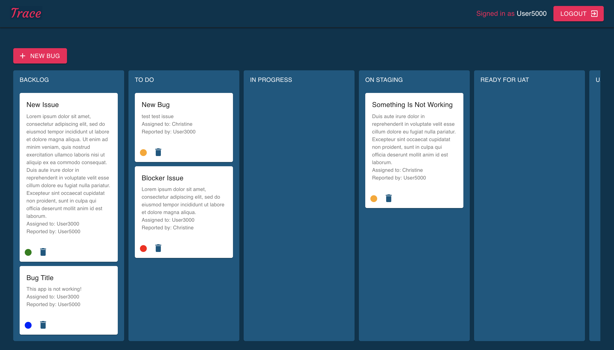
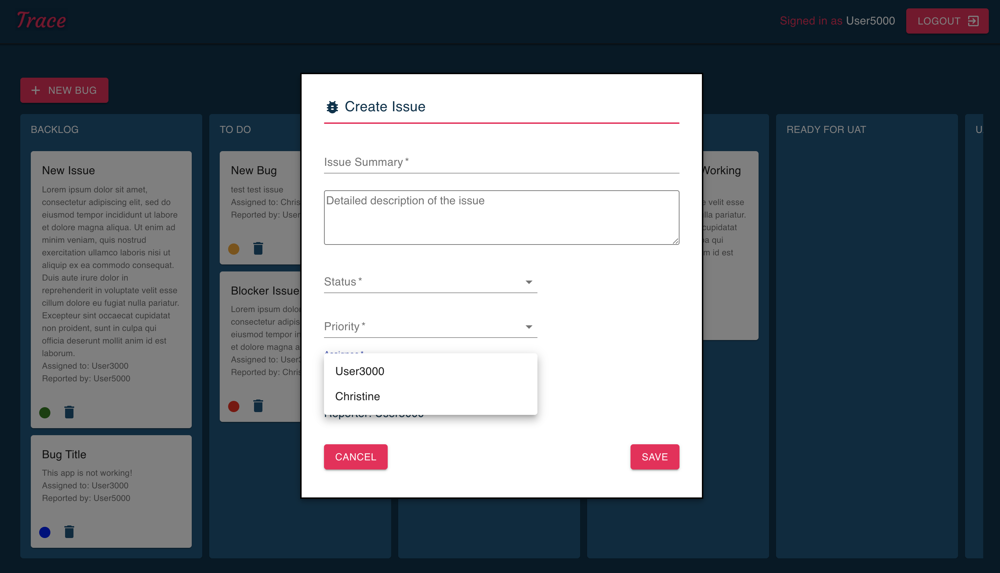
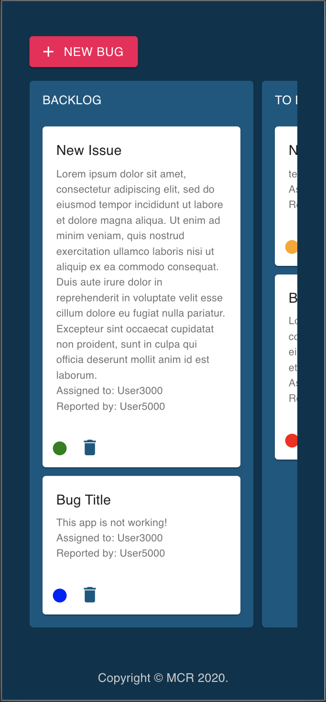
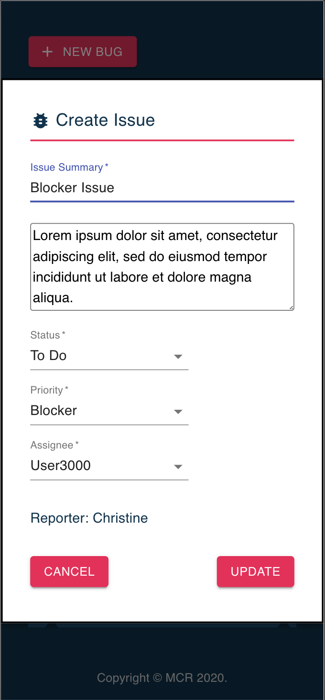

[](https://github.com/xtineroq?tab=followers)

# Trace - Bug Tracking Tool

## Description
➤ A full-stack MERN, this application helps users, developers and project managers to simplify reporting and tracking of bugs. Imagine having JIRA and Trello in one app where you can see all issues that have been reported in one board and have that ability to edit details, change priority, update status of each issues and assign them to specific developers.

Keep track of all issues reported from stashing them in the Backlog column to getting them actioned in the To Do, and seeing them through to being deployed live on production.

Features:
* Authentication - all users must sign up for an account to gain access to the board page
* Issue Form - specifically tailored to have fields similar to JIRA
* Clickable Cards - all issues submitted are automatically appended to the board as a card which can be clicked on to view the details
* Edit Functionality - each card opens up to a reusable React form component that lets users modify/update details of the issue
* Delete Functionality - each cards can easily be deleted from the board page using the delete/trash icon
* Priority - each card has an icon that changes color depending on the severity of the issue


## Table of Contents
* [Installation](#installation)
* [Usage](#usage)
* [License](#license)
* [Contributing](#contributing)
* [Tests](#tests)
* [Questions](#questions)
* [Screenshots](#screenshots)
* [Deployed Application](#deployed-application)

## Installation
Run `npm i` to install all dependencies

## Usage
This application is structured to have separate client and server. You will need to run `npm start` on both client and server side to start the application.

## License
This app is covered under the following license/s:


## Contributing
➤ This an open-source project. Contributions are welcome. Please contact the author for more information.

## Tests
```
npm run test
```

## Questions
Please direct all questions to:

👤 https://github.com/xtineroq

📧 mcroque89@gmail.com

## Screenshots



How the app looks on mobile:



## Deployed Application
[View on Heroku](https://trace-bug-tracker.herokuapp.com/)